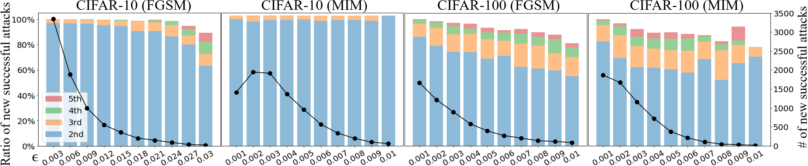
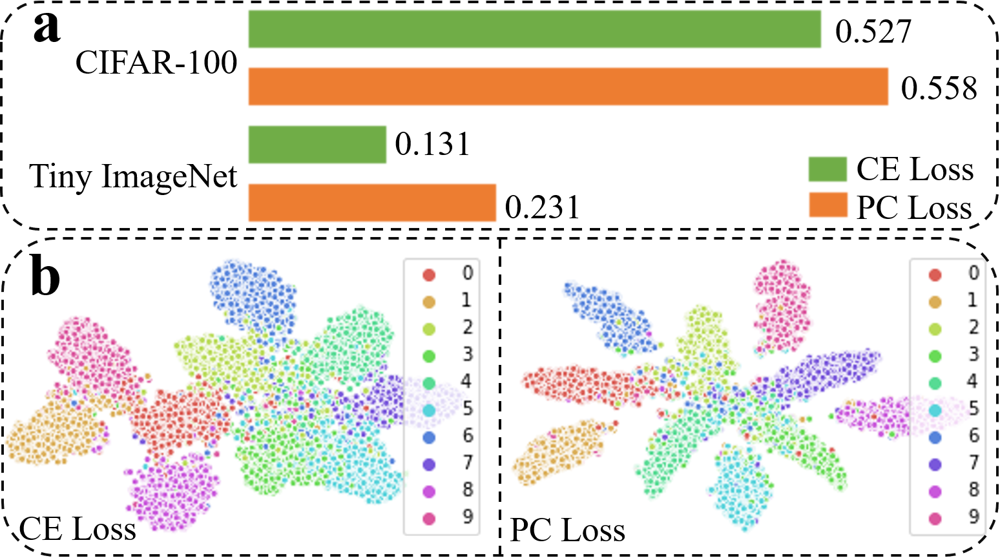
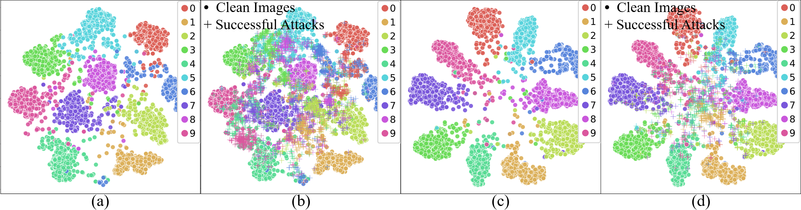

Overview
----
This repository is an implementation of the paper "[Improving Adversarial Robustness via Probabilistically Compact Loss with Logit Constraints](https://arxiv.org/pdf/2012.07688.pdf)".

Introduction
----
In this paper, we point out a unique insight from the predictive behavior of adversarial samples that they tends to be misclassified into the most probable false classes. This inspires us to propose a new Probabilistically Compact (PC) loss with logit constraints which is a drop-in replacement for cross-entropy (CE) loss to increase model adversarial robustness. Specifically, PC loss enlarges the probability gaps between true class and false classes meanwhile the logit constraints prevent the gaps from being melted by a small perturbation.


Predictive behavior of adversarial samples
----
<p></p
Empirical investigation on the predictive behavior of CNN on adversarial samples from CIFAR-10 and CIFAR-100. The line (black, right y-axis) represents the number of increased successful attacks when perturbation is increased from its previous grid value. Each bar (left y-axis) represents the percentage of misclassification for the increased successful attacks, measuring number of adversarial samples are misclassified into the 2nd, 3rd, 4th and 5th most probable classes. FGSM and MIM are attack methods.
      

Demo of Training effect
----
<p></p>
Here, we demonstrate the synergistic effect of the gaps at both probability and feature levels. As shown in the top, the average probability gaps between the true class and the most probable false class of ResNet-56 on CIFAR-100 testdata are 0.527 (CE loss) vs. 0.558 (PC loss). And for Tiny ImageNet test data the gaps become 0.131 (CE loss) vs. 0.231 (PC loss). These results demonstrate that our PC loss can directly enlarge the probability gap of prediction and the effect is more pronounced for more challenging dataset (Tiny ImageNet). As shown in the bottom, ResNet-56 trained with our PC loss has clear margin boundaries and samples of each classes are evenly distributed around the center with a minimal overlap on CIFAR-10 test data.


Results
----
<p></p>
T-SNE visualization of the penultimate layer of the model trained by CE loss (a,b) and our PC loss (c,d) on MNIST dataset. (a,c) display only clean images whereas (b,d) also include successful attacks generated with FGSM.
For a model trained with PC loss, due to the large margin between classes, the adversarial samples are harder to cross the boundaries with the only exception that the adversarial samples are distributed near the center of the feature space where hard samples are usually located.


Model Training and Evaluation
----


Dependencies
-----
* Python 3.7
* Pytorch 1.3


Citation
------
```
Xin Li, Xiangrui Li, Deng Pan and Dongxiao Zhu
Improving Adversarial Robustness via Probabilistically Compact Loss with Logit Constraints, arXiv:2012.07688, 2020  
https://github.com/xinli0928/PC-LC
```

```
@misc{li2020improving,
      title={Improving Adversarial Robustness via Probabilistically Compact Loss with Logit Constraints}, 
      author={Xin Li and Xiangrui Li and Deng Pan and Dongxiao Zhu},
      year={2020},
      eprint={2012.07688},
      archivePrefix={arXiv},
      primaryClass={cs.LG}
}
```
